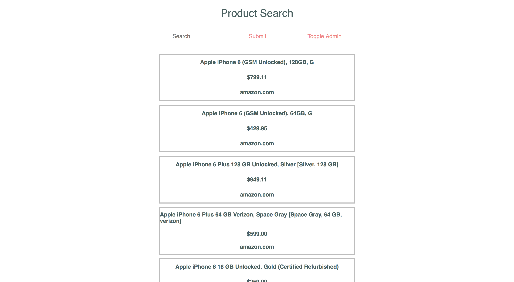
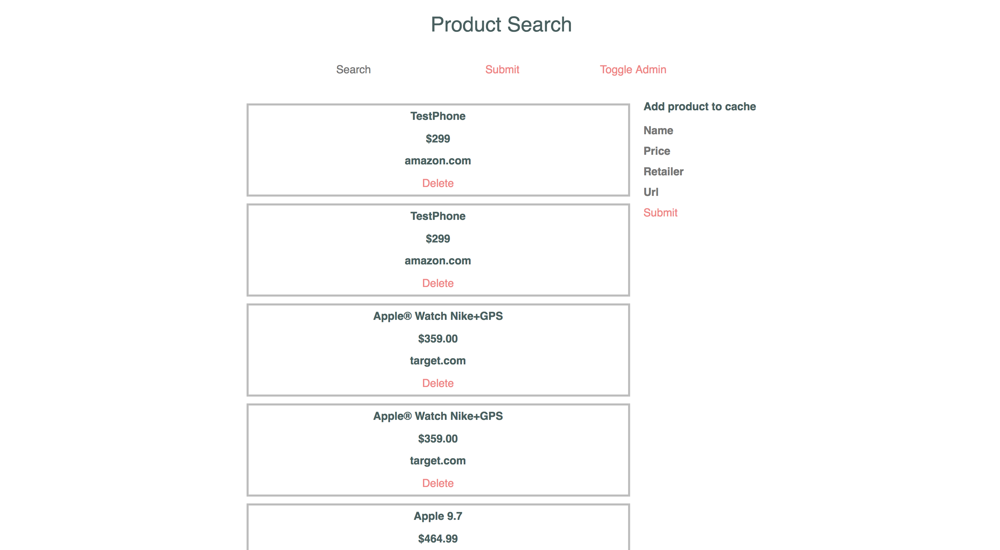

# Product Search

Product Search is an application that allows users to search for their favorite products. Product information is collected through the Semantics3 Api, and results are cached for quick reads.

## Features and Implementation

### Cacheing search results



Users interact with a simple react interface and search for products. Subsequent searches of the same products are much faster than the first because of cacheing.

```
res = SearchWord.where(name: params[:search])

if res.empty?

  @items = Sem3SearchService.new(params).execute
  word = SearchWord.new({name: params[:search]})

  if word.save!
    cache(word)
  else
    render json: ["Unable to save word to cache"], status: 500
  end

else
  word = res[0]
end

```

### Admin



"Admin" users of the application will be able to manage their local cache. They will have the ability to add new items as well as delete items from the cache.
